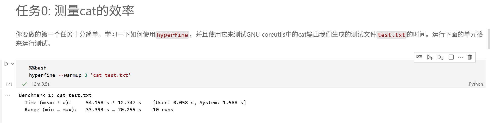
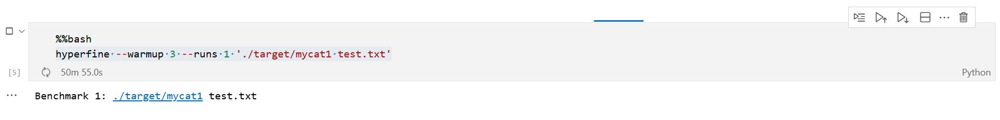
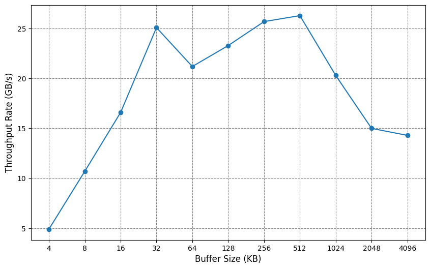
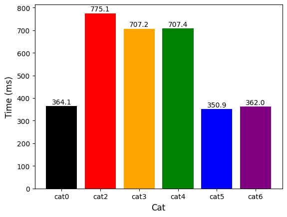

# MeowLab实验报告

| 姓名 | 学号       |
| ---- | ---------- |
| 仇嘉惟 | 2023202251 |

## Task0
即使任务0只是运行一行代码，我一开始也遇到了困难：

系统cat都要花费54秒，这显然是意料之外的

不过，我很快找到了原因：我一开始把有关文件下载和生成在了windows文件系统下，之后却用wsl里的程序来访问这些文件，这就变成了一个跨文件系统的访问，效率低下

之后把这些文件重新下载和生成到wsl系统内，问题就解决了，系统cat只需要360ms左右

这开幕第一课就告诉了我们理解文件系统的重要性

## Task1
任务1实现的核心代码如下
```c
    char buffer[1];
    ssize_t bytes_read;
    while ((bytes_read = read(fd, buffer, sizeof(buffer))) > 0)
        write(STDOUT_FILENO, buffer, bytes_read);
```
cat1花费了极多的时间，hyperfine对它的测试花费了50分钟还没有结束，遂放弃该测试


每次只读写1个字节，带来了大量的系统调用开销

## Task2
使用```sysconf(_SC_PAGESIZE)```可以获取系统中一个内存页的大小，任务2核心代码如下
```c
    long block_size = get_io_block_size();
    char *buffer = malloc(block_size);
    ssize_t bytes_read;
    while ((bytes_read = read(fd, buffer, block_size)) > 0)
        write(STDOUT_FILENO, buffer, bytes_read);
```
cat2直接进入了几百毫秒的级别，是巨大的优化

## Task3
实现对齐到系统内存页的核心代码如下：
```c
void *align_alloc(size_t size, size_t alignment)
{
    size_t offset = alignment - 1 + sizeof(void*);
    void *p1 = malloc(size + offset);
    if (p1 == NULL)return NULL;
    void *p2 = (void*)(((uintptr_t)p1 + offset) & ~(alignment - 1));
    ((void**)p2)[-1] = p1;
    return p2;
}

void align_free(void *ptr)
{
    if (ptr == NULL)return ;
    void *p1 = ((void**)ptr)[-1];
    free(p1);
}
```
### 问题回答：
1. **为什么将缓冲区对齐到系统的内存可能提高性能？你的实验结果支持这个猜想吗？为什么？**

缓冲区对齐到系统的内存可以优化数据的传输效率

如果用户缓冲区没有对齐系统内存，跨越了多个页，拷贝次数和计算次数会变多，导致性能下降；而当用户缓冲区大小为一个页，并且起始地址也与页边界对齐时，这个缓冲区就完美地对应一个物理内存页；内核在拷贝数据时可能可以使用CPU的特殊指令或DMA引擎来执行一个“页到页”高速拷贝

实验结果是cat2为**775.1ms**，而cat3为**707.2ms**，这个提升不是很明显，因而不是很支持这个猜想

经查阅资料，这种优化在使用“直接I/O”时效果较好，而在使用“标准I/O”的情况下提升较小

我们现在使用的是“标准I/O”，这种情况下，调用`read()`，数据通常会先从磁盘被读入内核的页缓存中；然后，内核再将数据从页缓存拷贝到用户缓冲区里；因为内核数据拷贝的快速，对齐带来的提升较小，很容易被其他开销所掩盖

而对于“直接I/O”，它会绕过内核的页缓存，直接在磁盘和用户空间缓冲区之间传输数据；此时操作系统对用户缓冲区有严格的要求，其中一条就是缓冲区地址必须对齐到内存页边界，并且读写大小也必须是扇区大小的整数倍，如果满足这些条件，数据传输就可以通过DMA完成，无需CPU介入拷贝，数据传输路径更短，性能更高

综上，在内核的页缓存已经介入的情况下，对齐带来的收益较小，页缓存已经帮你优化了很多

2. **为什么我们直接使用`malloc`函数分配的内存不能对齐到内存页，即使我们分配的内存大小已经是内存页大小的整数倍了。**

malloc首要任务是在满足不同大小请求的同时，最大限度地减少内存碎片、提高内存利用率，并非专门为高性能I/O等特殊场景设计；同时，C语言标准只要求malloc返回的地址满足基本对齐，即可以存放任何基本数据类型而不会出错，这通常是8或16字节对齐

向malloc请求的内存大小只决定了它需要找到多大的一块连续内存，但这块内存的起始地址在哪里，完全取决于malloc内部的堆管理算法和当时堆的状态；它需要优先利用现有的、大小合适的空闲内存块，而不是为了对齐而去浪费内存

3. **你是怎么在不知道原始的malloc返回的指针的情况下正确释放内存的？**

在分配的指针前面多余的空间，可以把原始指针存起来；请求 `size + alignment - 1 + sizeof(void*)`这么多的内存，保证了我们有足够的空间来找到对齐地址并在对齐地址前多存一个指针。

如前代码所展示的，利用`((void**)p2)[-1] = p1;`可以让对齐地址前面再存一个指针；当需要`free`时，只需利用`p2`找回`p1`，再对`p1`进行`free`就行

## Task4

### 问题回答：

1. **为什么在设置缓冲区大小的时候需要考虑到文件系统块的大小的问题？**

文件在物理磁盘上以块为单位存储的；文件系统也使用“块”作为管理和读写的基本单元；当请求的数据量是文件系统块大小的整数倍时，请求可以直接映射到对一个或多个完整文件系统块的读取；这避免了内核为了满足请求去读取一个完整的块，但只拷贝其中一部分数据的情况，更充分地利用了磁盘

同时，如果要写入的数据不足一个文件系统块，并且不是从块的起始位置开始写，文件系统可能需要先将整个旧块读入内存，把新的数据合并进去，然后再把修改后的完整块写回磁盘；而通过使用块大小整数倍的缓冲区，可以确保大多数写操作都是以完整块的形式进行

2. **对于上面提到的两个注意事项你是怎么解决的？**

通过使用
```c
    struct stat file_stat;
    fstat(fd, &file_stat);
    long fs_block_size = file_stat.st_blksize;
```
可以得知所打开文件对应的块大小

在确定缓冲区大小时，如何既考虑到内存页大小也考虑到文件系统的块大小呢？答案是取二者之最小公倍数，使得缓冲区大小同时为内存页大小与文件系统块大小的倍数

因为内存页大小必为2的整数次幂，那么我们最后确定的缓冲区大小也必为2的整数次幂，如此，自然解决了第二个注意事项

然而，在这里cat4结果为**707.4ms**，并没有什么优化

## Task5

代码见`meowlab.ipynb`

### 问题回答：

1. **解释一下你的实验脚本是怎么设计的。你应该尝试了多种倍率，请将它们的读写速率画成图表包含在文档中。**

脚本核心即为`dd`命令，利用`bs`参数控制读写块大小，即设置缓冲区大小

取输入文件为`/dev/zero`，对它的读取完全在内核内存中发生，不涉及任何物理磁盘的寻道和读取操作

同时，取输出文件为`/dev/null`，它会接收并丢弃所有写入它的数据，同样不涉及任何物理磁盘的写入操作

使用这两个输入输出使得我们可以将测量的瓶颈从磁盘读取转移到系统调用

为了研究缓冲区大小的影响，我们需要保证每次`dd`传输数据的总大小相同，这通过`bs`与`count`参数协调完成；`count`决定了要传输多少数量的块，而`bs`决定每次传输的块大小，只要使得`bs*count`为一常数即可，我这里取这个常数为1GB

综上，`dd`命令的主要工作就是从内核的一个缓冲区读取数据，通过一个用户空间的缓冲区进行中转，再写入到内核的另一个缓冲区，而这个过程的效率主要受限于`read()/write()`系统调用的开销，根据结果就可以知道最适合的缓冲区大小为多少了

实验后发现`test.txt`对应的文件系统块大小与这里的内存页大小均为4096，因而cat4的提升不大，因为cat4综合考虑二者后缓冲区大小仍为4096

据此可确定buf_size为4096，接下来对倍率A的取值进行测试，这里A取2的整数次幂[1, 2, 4, 8, 16, 32, 64, 128, 256, 512, 1024]

问题来了，我们总不可能一个个情况手动去试，所以这里我采用python的`subprocess`，利用它运行子进程，捕获并解析输出，自动化测试，最终根据输出作出图表

最终得到图表：




这里出现了两个极大点，经测试，取`512KB`效果略优于`32KB`，最终取`512KB`为缓冲区大小；此时系统对应吞吐量为`26.30 GB/s`

最终cat5用时达到了**350.9ms**，与系统cat近似甚至略优于系统cat！

## Task6

### 问题回答：

1. **你是如何设置`fadvise`的参数的？**

我按以下代码使用`fadvise`
```c
posix_fadvise(fd, 0, 0, POSIX_FADV_SEQUENTIAL);
```
其中第一个参数为文件描述符；

第二个参数为偏移量，它参数指定了建议生效的起始文件位置，而0表示从文件的最开始；

第三个参数为长度，当它为0时，表示这个建议从offset开始到文件末尾一直生效，而cat刚好就是要完整处理整个文件，所以设置为0

第四个参数是建议类型，我选择了`POSIX_FADV_SEQUENTIAL`，这表示接下来这个文件将被顺序读取，符合cat的工作流程

综上，我们告诉内核我们将从头到尾顺序读取整个文件，它就能更好地安排readahead

2. **对于顺序读写的情况，文件系统可以如何调整readahead？对于随机读写的情况呢？**

当顺序读写时，内核会增加预读的数据量；当应用程序正在读取文件的某一块时，内核可能已经开始将它后面的相邻块异步地从磁盘读入内存；最终，当应用程序调用`read`时，需要的数据很大概率已经存在于高速的内存页缓存中了

当随机读写时，情况与顺序读写时相反；此时进行预读效果不好，因为预读的数据在下一次`read`时被用到的概率很小；如果过多地预读会浪费I/O资源和缓存资源；因此，内核会大幅减少预读，按照实际需要进行读取，避免浪费

采用`fadvise`后最终时间，为**362.0ms**，与cat5差别不大，甚至略有下降

## Task7

### 问题回答：

1. **你的全部实验结果的柱状图。**

如图所示，因为cat1运行时间太久，这里忽略它


2. **你对上述实验结果的分析。**

结果并不是理想的每完成一步就大大提升一步，这给我带来了诸多启示

**cat1->cat2**: 巨大的提升，符合预期

原因：cat1进行了海量的系统调用，每次`read(1)`都是一次用户态到内核态的上下文切换;而通过在cat2引入缓冲区，我们大大减少了系统调用次数，提高了性能

启示：缓冲思想十分重要，了解每个函数和系统的运行原理是优化性能的不二法门

**cat2->cat3**：微小的提升，不符合一开始的预期

原因：“标准I/O”下，调用`read()`，数据通常会先从磁盘被读入内核的页缓存中；然后，内核再将数据从页缓存拷贝到用户缓冲区里；因为内核数据拷贝的快速，对齐带来的提升较小，很容易被其他开销所掩盖

启示：并非每一个优化都会有肉眼可见的成效，确定真正的瓶颈问题至关重要

**cat3->cat4**：几乎没有变化，不符合一开始的预期

原因：在cat5的探索中发现`test.txt`对应的文件系统块大小与内存页大小一致，那么最小公倍数策略等于没有起到作用，因而也就没什么性能变化

启示：理论的优化会有差池，要用实践来检验真理

**cat4->cat5**：显著的优化，符合预期

原因：通过增大缓冲区，增大单次I/O数据量，可以摊薄系统调用的开销

启示：利用`dd`和`/dev/null`、`/dev/zero`进行实验测试真是一个精巧的想法，设计实验是进行优化的重要组成部分；当我们发现瓶颈时，要利用各种方法和思维优化它

**cat5->cat6**：并没什么优化，反而有所降低，不符合预期

原因：这可能是由于现代的Linux内核已经非常智能，拥有自适应的预读算法；当程序开始顺序读取文件的前几个块时，内核会自动检测到这个顺序读取模式，并开始自动地执行预读操作；此时再用`fadvise`实际上是在告诉内核一件它已经知道并且已经在做的事情，这个“建议”是多余的，而且本身还有开销

启示：任何优化需要结合具体实际才能体现它的效果，要为优化找到适合它的“用武之地”，不存在所谓“万金油”

结合以上所有，还可以总结出以下**启示**：

1. **精益求精，永无止境**：一部分早期的优化可以带来巨大的提升(cat1->cat2)，而后续的工作则是在精益求精，我们要发扬这种精益求精的精神，也要锻炼识别并优先解决最主要的瓶颈的能力

2. **实践出真知**：理论分析为我们指明了优化的方向，但无法将所有细节都考虑周全，也往往难以给出一个适合所有情况的最佳方案；因此，我们要通过严谨的实验，在实践中验证理论、补充理论

3. **理解系统，与系统成为朋友**：程序是建立在系统之上的，不理解系统就不可能写出好的程序；深刻把握系统工作原理，并让我们的程序去配合它，才能取得最好的效果
